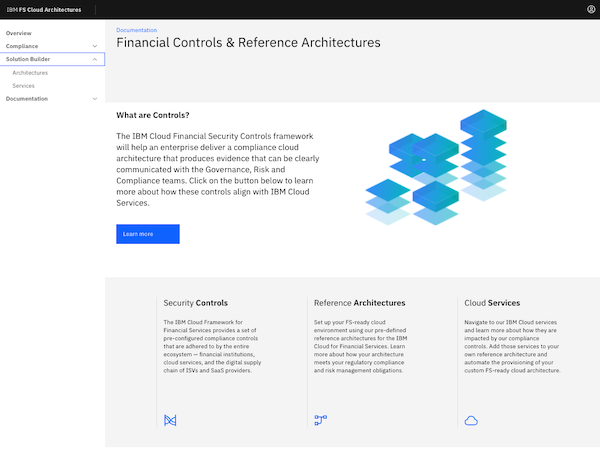
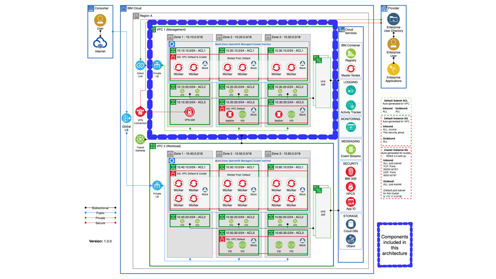

# IBM Cloud for Financial Services - Reference Architectures

> These automation packages have been crafted from a collection of [Terraform modules](https://github.com/cloud-native-toolkit/garage-terraform-modules/blob/main/MODULES.md) created by GSI Labs team part of the Hybrid Cloud Ecosystem organization. Please contact `Matthew Perrins` **mjperrin@us.ibm.com** or `Sean Sundberg` **seansund@us.ibm.com** for more details

This automation package was created by the open-source [`isacable` tool](https://github.com/cloud-native-toolkit/iascable). Each Bill of Material package can be defined in YAML file and it will generate the automation. This can also be delivered with the user interface tool where the mapping from the 280 Financial Controls is defined to the Cloud Services that are included in the Bill of Materials.



The IBM Cloud for Financial Services defines a set of reference architectures and best practices for establishing a security cloud environment that will enable the management of regulatory workloads.

The repository defines a set of Terraform automation that embodies these best practices for provisioning cloud resources in an IBM Cloud Enterprise Sub account. This guide will help describe the SRE steps required to provision an FS Cloud environment that will scan cleanly to the Security and Compliance FS Controls and NIST profiles.

This guide is optimized for Proof of Technology environments that will enable Global Partners and ISVs to configure a fully working end to end cloud native environment. This will include Management with Bastion and Client to Site VPN. It will include Workload with OpenShift and support the Red Hat Software Delivery Lifecycle with the Cloud-Native Toolkit.

Automation is provided in following Terraform packages that will need to be run in order.

## Reference Architecture

The following is provisioned.



> Limitations, SCC scan has identified a number of gaps that are being work and will be release soon.

## Automation Stages

Download the Following Terraform Reference Architecture Bill of Materials from the UI Mapper Tool or clone from GitHub. For reference, the latest version of the Terraform generated from the CLI tool can be found here - https://github.ibm.com/gsi-labs/fscloud-reference-architectures. 

- [100 - Common Services](./100-common-services)
- [120 - Management + OpenShift Cluster](./110-mzr-management-openshift)
- [140 - Workload + OpenShift Cluster](./140-mzr-workload)
- [160 - Developer Tools into Management Cluster](./160-openshift-dev-tools)

We also include packages for none OpenShift configurations
- [110 - Management VSI](./110-mzr-management)
- [130 - Workload VSI](./130-mzr-workload)

## Prerequisites

1. Have access to an IBM Cloud Account, Enterprise account is best for workload isolation but if you only have a Pay Go account this set of terraform can be run in that level of account for Proof of Technologies.

2. Download OpenVPN Client from https://openvpn.net/vpn-server-resources/connecting-to-access-server-with-macos/#installing-a-client-application for your client device, this has been tested on MacOS

3. At this time the most reliable way of running this automation is with Terraform in your local machine either through a bootstraped docker image or with native tools installed. The schematics service is producing intermitant issues.


# Setup

## Hyper Protect Crypto

The first step is provision a Hyper Protect Crypto Services instance into the nominated account and initialise the key ceronmony. You can do this with the following automation. We recommend to follow the product docs to perform the quick initialization.  

[Hyper Protect Cyrpto Service Documentations](https://cloud.ibm.com/docs/hs-crypto?topic=hs-crypto-get-started)

For proof of technology environments we recommend using the `auto-init` feature. [Auto Init Documentations](https://cloud.ibm.com/docs/hs-crypto?topic=hs-crypto-initialize-hsm-recovery-crypto-unit)  

### Generate HPCS RootKey

Once the HPCS instance has been initialized create a Root Key.

1. IBM Cloud Console -> Click on the service instance of Hyper Protect Crypto service 
2. In HPCS service instance page, go to Key management service keys
3. Click on **Add Key** to create a new Root key
4. In Add Key page, provide the details 
    - Key type : Root key
    - Key name : Enter a name for your root key
    - Key ring ID: choose default
    - Expiration date: Chose a date and time   
5. Click **Create**
6. Copy the value from ID field 

## Terraform IasC Automation

1. Clone this repository to you local SRE laptop
2. Create a directory where the zips will be extracted (e.g. `arch-builder`)
3. Extract each of the Terraform zips in the `arch-builder` directory
4. Copy the template `terraform.tfvars` file into the `arch-builder` directory (this file is a composite of each of the *.auto.tfvar files in each of the terraform BOMs) - [Example Variables configuration File in Gist](https://gist.github.com/seansund/a1bcfac33943e3b6c4675d4596e5d49f) download this contents and modify it for you POT environment specifics.
5. Generate the SSH keys in the `arch-builder` directory using the instructions below. You will need 3 key pairs for the Management BOM and 3 key pairs for the Workload BOM.
6. Create two SCC collectors with private endpoints following the instructions below, one for Management BOM and one for Workload BOM. Set the values for `mgmt_scc_registration_key` and `workload_scc_registration_key` in `terraform.tfvars`.
7. Create a root key in the HPCS instance.
8.Get the id from the root key that was created and set it in the `kms_key_id` field in `terraform.tfvars`.
9. Update `terraform.tfvars` with the appropriate values for your deployment. Note: The values are currently set up to place everything in the same resource group. To use different resource groups, provide different values for each of the `*_resource_group_name` variables and comment out the `*_resource_group_provision="false"` values
10. Go into each of the subdirectories where the terraform has been extracted (e.g. `100-common-services`) and create a soft link back up to the terraform.tfvars file and the ssh keys - `ln -s ../terraform.tfvars . && ln -s ../ssh-* .`


## Generate SSH Keys

You need to create a set of unique keys that will be configured for the various components that are provisioned by the Terraform automation. 

1. The command to generate the ssh keys is `ssh-keygen -t rsa -b 3072 -N "" -f {name}`


2. You will want to run the command 6 times to generate the keys. If you are keeping with the names in the `terraform.tfvars` file then run the following:

```
ssh-keygen -t rsa -b 3072 -N "" -f ssh-mgmt-openvpn
ssh-keygen -t rsa -b 3072 -N "" -f ssh-mgmt-bastion
ssh-keygen -t rsa -b 3072 -N "" -f ssh-mgmt-scc
ssh-keygen -t rsa -b 3072 -N "" -f ssh-workload-openvpn
ssh-keygen -t rsa -b 3072 -N "" -f ssh-workload-bastion
ssh-keygen -t rsa -b 3072 -N "" -f ssh-workload-scc
```


## Generate SCC credentials

Set API Key for Security and compliance

1. IBM Cloud console, click the Menu  > Security and compliance
2. Under Manage Posture, click Confgiure > Settings > Credentials.
3. Click on Credential to create new credential
4. Provide name. 
 - Select purpose as  Discovery/Collection.
 - Click Next
 - Under Credential Type , chose IBM Cloud
 - Enter your IBM API Key in the  IBM API Key text box.

Now Generate SCC registration key 


6. IBM Cloud console, click the Menu  > Security and compliance
7. Under Manage Posture, click Configure > Settings > Collectors
8. Click on Create 
- Enter a name for the collector
- Chose Collector Endpoint : Private endpoint
- Click Create
9. Now, on the Collectors tab
10. Click on the collector you have created 
11. Copy the "Registration key" to provide in the scripts for SCC collector


## Terraform Apply

1. Export your IBM Cloud API Key into an environment variable named APIKEY - export APIKEY="xxx"
2. With the terminal open in the `arch-builder` directory, start the cli-tools docker container - `docker run -it -e TF_VAR_ibmcloud_api_key=$APIKEY -e IBMCLOUD_API_KEY=$APIKEY -v ${PWD}:/terraform -w /terraform quay.io/ibmgaragecloud/cli-tools:v0.12.0-lite`
3. The container should have opened with `/terraform` as the working directory which should be mounted from the `arch-builder` directory on the host.
4. Change directory to the terraform directory that will be applied (e.g. `100-common-services`)
5. Initialize the environment with `terraform init`
6. Apply the terraform with `terraform apply -auto-approve`. If all is configured properly you should not be prompted again and the terraform should run to completion


## Configure VPN

After running the `120 Management + OpenShift` architecture and before running `160 OpenShift Developer Tools`, the VPN server needs to be set up.

1. Open the IBM Console and go to the VPC Virtual Server Images page - https://cloud.ibm.com/vpc-ext/compute/vs
2. Find the VPN VSI instance in the list. (It will have a name like `{mgmt_name_prefix}-vpc-openvpn-00`.) Copy the value for the Floating IP.
4. Open a terminal to the `arch-builder` directory (or wherever the SSH keys are located).
5. SSH into the OpenVPN server - `ssh -i mgmt-openvpn root@${floating_ip}`
6. Generate a new VPN configuration by running `openvpn-config.sh`. Follow the prompts to add a user. When the command is complete it will generate a file in `/root` named after the userid you provided. The file name is printed at the end of the command output.
7. Exit the SSH session
8. Use secure copy to bring the ovpn file down to your machine - `scp -i mgmt-openvpn root@${floating_ip}:/root/${user}.ovpn .`
9. Import the ovpn file into your OpenVPN client and start the VPN connection. You  should now have connectivity into the private VPC network and access to the OpenShift Management Console.

## Reference


## Troubleshooting 

