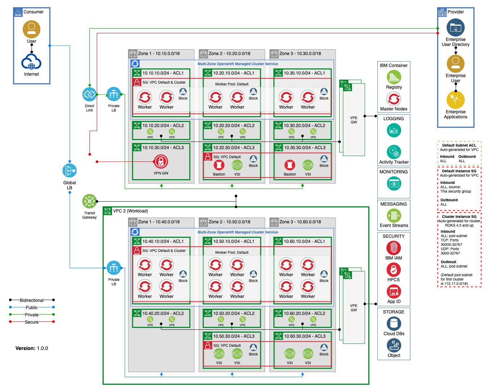

# IBM Cloud for Financial Services - Terraform Automation

### Change Log

- **11/2021** - Updated to use Client-to-site VPN service (beta) instead of a VSI running a VPN server
- **11/2021** - Updated to support the Edge VPC infrastructure in addition to Management and Workload VPCs.

> This collection of IBM Cloud terraform automation bundles has been crafted from a set of [Terraform modules](https://github.com/cloud-native-toolkit/garage-terraform-modules/blob/main/MODULES.md) created by GSI Labs team part of the [Hybrid Cloud Ecosystem organization](https://w3.ibm.com/w3publisher/cloud-ecosystem). Please contact **Matthew Perrins** __mjperrin@us.ibm.com__, **Sean Sundberg** __seansund@us.ibm.com__, or **Andrew Trice** __amtrice@us.ibm.com__ for more details.

The IBM Cloud defines three reference architectures for IBM Cloud for Financial Services. These reference architectures establish a secure cloud environment that will enable the deployment and management of regulatory compliant workloads. This repository addresses the [VPC architecture with virtual servers](https://test.cloud.ibm.com/docs/allowlist/framework-financial-services?topic=framework-financial-services-vpc-architecture-detailed-vsi) and [VPC architecture with Red Hat OpenShift](https://test.cloud.ibm.com/docs/allowlist/framework-financial-services?topic=framework-financial-services-vpc-architecture-detailed-openshift) architectures.

Within this repository you will find a set of Terraform template bundles that embody best practices for provisioning and configuring cloud resources in an IBM Cloud Enterprise sub-account.

This `README.md` describes the SRE steps required to provision an IBM Cloud for Financial Services environment that will scan cleanly to the Security and Compliance Centers NIST based profiles.

> The Security and Compliance scan has a set of known [exceptions](#exceptions) see below

This guide is optimized for Proof of Technology environments that enable IBM Cloud users to configure a fully working end-to-end cloud-native environment. The base environment provides a collection of shared services, a management network, and a workload network.

**Shared services**

- Hyper Protect Crypto Service
- IBM Log Analysis
- IBM Monitoring
- Activity Tracker
- Certificate Manager

**Edge network**

- Client to Site VPN server or Site to Site VPN Gateway
- Bastion server(s)

**Management network**

- Red Hat OpenShift cluster with SDLC tools provided from the [Cloud-Native Toolkit](https://cloudnativetoolkit.dev/)

**Workload network**

- Red Hat OpenShift cluster

This set of automation packages was generated using the open-source [`isacable`](https://github.com/cloud-native-toolkit/iascable) tool. This tool enables a Bill of Material yaml file to describe your IBM Cloud architecture, which it then generates the terraform modules into a package of infrastructure as code you can use to accelerate the configuration of your IBM Cloud environment. Iascable generates standard terraform templates that can be executed from any terraform environment.

Automation is provided in following Terraform packages that will need to be run in order.

## Reference Architecture



## Automation Stages

Clone this repository to access the automation to provision this reference architecture on the IBM Cloud. This repo contains the following defined _Bill of Materials_ or **BOMS** for short. They logically build up to deliver a set of IBM Cloud best practices. The reason for having them seperate at this stage is to enabled a layered approach to success. This enables SRE's to use them in logical blocks. One set for Shared Services for a collection of **Edge**, **Management** and **Workload** VPCs or a number of **Workload** VPCs that maybe installed in separate regions.

### VPC with VSIs

| BOM ID | Name                                           | Description                                                                                                                         | Run Time |
| ------ | ---------------------------------------------- | ----------------------------------------------------------------------------------------------------------------------------------- | -------- |
| 000    | [000 - Account Setup](./000-account-setup)     | Set up an account for FS Cloud and provision a set of account-wide services. This is intended to only be run one time in an account | 5 Mins   |
| 100    | [100 - Shared Services](./100-shared-services) | Provision a set of common cloud managed services that can be shared with a Edge, **Management** and **Workload** VPCs               | 5 Mins   |
| 110    | [110 - Edge VPC](./110-edge-vpc)               | Provision an **Edge VPC** with Client to Site VPN & Bastion                                                                         | 10 Mins  |
| 120    | [120 - Management VPC](./120-management-vpc)   | Provision a **Management VPC** and connect to Transit Gateway                                                                       | 10 mins  |
| 140    | [140 - Workload VPC](./140-workload-vpc)       | Provision a **Workload VPC** and connect to Transit Gateway                                                                         | 10 mins  |

### VPC with Red Hat OpenShift

| BOM ID | Name                                                                       | Description                                                                                                                                                                   | Run Time |
| ------ | -------------------------------------------------------------------------- | ----------------------------------------------------------------------------------------------------------------------------------------------------------------------------- | -------- |
| 000    | [000 - Account Setup](./000-account-setup)                                 | Set up an account for FS Cloud and provision a set of account-wide services. This is intended to only be run one time in an account                                           | 5 Mins   |
| 100    | [100 - Shared Services](./100-shared-services)                             | Provision a set of common cloud managed services that can be shared with a Edge, **Management** and **Workload** VPCs                                                         | 5 Mins   |
| 110    | [110 - Edge VPC](./110-edge-vpc)                                           | Provision an **Edge VPC** with Client to Site VPN & Bastion                                                                                                                   | 10 Mins  |
| 130    | [130 - Management + OpenShift Cluster](./130-management-vpc-openshift)     | Provision a **Management VPC** with and Red Hat OpenShift Cluster and connect to Transit Gateway                                                                              | 45 mins  |
| 150    | [150 - Workload + OpenShift Cluster](./150-workload-vpc-openshift)         | Provision a **Workload VPC** with Red Hat OpenShift Cluster and connect to Transit Gateway                                                                                    | 45 mins  |
| 160    | [160 - Developer Tools into Management Cluster](./160-openshift-dev-tools) | Provision a set of common CNCF developer tools into Red Hat OpenShift to provide a DevSecOps SDLC that support industry common best practices for CI/CD                       | 20 mins  |
| 165    | [165 - Workload Cluster setup](./165-openshift-workload)                   | Binds the cluster to the IBM Logging and IBM Monitoring instances in shared services, sets up some basic cluster configuration, and provisions ArgoCD into the cluster for CD | 10 mins  |

### Configuration guidance

There are a couple of things to keep in mind when preparing to deploy the architectures that will impact the naming conventions:

#### Creating multiple Management or Workload deployments

If you are planning to create multiple instances of the Management or Workload architecture in the same account, the following must be accounted for:

- Each deployment should use different values for `name_prefix` to keep the resources isolated

## Prerequisites

1. Have access to an IBM Cloud Account, Enterprise account is best for workload isolation but if you only have a Pay Go account this set of terraform can be run in that level of account.

2. Download OpenVPN Client from https://openvpn.net/vpn-server-resources/connecting-to-access-server-with-macos/#installing-a-client-application for your client device, this has been tested on MacOS

3. At this time the most reliable way of running this automation is with Terraform in your local machine either through a bootstrapped docker image or with native tools installed.

> The schematics service is producing intermittent issues.

## Setup

### Hyper Protect Crypto

The first step is provision a Hyper Protect Crypto Services instance into the nominated account and initialise the key ceronmony. You can do this with the following automation. We recommend to follow the product docs to perform the quick initialization.

[Hyper Protect Cyrpto Service Documentation](https://cloud.ibm.com/docs/hs-crypto?topic=hs-crypto-get-started)

For proof of technology environments we recommend using the `auto-init` feature. [Auto Init Documentation](https://cloud.ibm.com/docs/hs-crypto?topic=hs-crypto-initialize-hsm-recovery-crypto-unit)

#### <a name="enable-financial-services-validated-account-flag"></a> Enable the account to use Financial Services Validated products

Enable your IBM Cloud account to use Financial Services Validated Products

1. Open the IBM Cloud console and click on **Manage** down arrow and select **Account** - https://cloud.ibm.com/account
2. After selecting **Account**,select **Account settings** from the left side menu - https://cloud.ibm.com/account/settings
3. Click **On** for the Financial Services Validated option.
4. Read the information about enabling the setting, and select **I understand and agree to these terms**.Click **On**.

[Financial Services Validated Button](./images/ibm-cloud-architecture.png)

### Terraform IasC Automation

1. Clone this repository to your local SRE laptop and open a terminal to the cloned directory.
2. Determine what type of deployment you will be doing. There are currently two template FLAVORS available:
   - `full`: Full IBM Cloud Financial Services reference architecture deployment, including Hyper Protect Crypto Services instance.
   - `small`: IBM Financial Services reference architecture scaled down for a POC environment deployment. Hyper Protect Crypto Service has been replaced with Key Protect and the clusters have been reduced to single region.
3. Determine which reference architecture you will be deploying. There are currently two options available:
   - `vpc`: IBM Cloud for Financial Services VPC with virtual servers reference architecture
   - `ocp`: IBM Cloud for Financial Services VPC with Red Hat OpenShift reference architecture
4. Run the `setup-workspace.sh -t {FLAVOR} -a {ARCH}` script to create a copy of the Terraform scripts in a `workspace/` directory and generate the SSH keys needed for the various VSI instances.
5. Update **terraform.tfvars** in the `workspace/` directory with the appropriate values for your deployment. Note: The values are currently set up to place everything in the same resource group. To use different resource groups, provide different values for each of the `*_resource_group_name` variables and comment out the `*_resource_group_provision="false"` values.

## Terraform Apply

### Set up credentials

1. Copy `credentials.template` to `credentials.properties`.
2. Provide your IBM Cloud API key as the value for the `ibmcloud.api.key` variable in `credentials.properties` (**Note:** `*.properties` has been added to `.gitignore` to ensure that the file containing the apikey cannot be checked into Git.)

### Apply all architectures in the solution

1. From the root of the cloned repository directory, run `./launch.sh`. This will start a docker container that contains the required libraries to run the terraform scripts.
2. The container should have opened in the `/terraform/workspace` as the working directory which should be mounted from repository directory on the host.
3. Run the `./apply-all.sh` script to sequentially provision the included architectures.

**Note:** You can clean everything up by running `./destroy-all.sh`. It will destroy each architecture in reverse order.

### Apply each architecture in the solution

1. From the root of the cloned repository directory, run `./launch.sh`. This will start a docker container that contains the required libraries to run the terraform scripts.
2. The container should have opened in the `/terraform/workspace` as the working directory which should be mounted from repository directory on the host.
3. Change directory to the terraform directory that will be applied (e.g. `100-common-services`)
4. Initialize the environment with `terraform init`
5. Apply the terraform with `terraform apply -auto-approve`. If all is configured properly you should not be prompted again and the terraform should run to completion.
6. It is recommended to run Terraform bundles in this order:
   - `110`
   - `130`
   - `150`
   - Connect to the VPN (see instructions below)
   - `160`
   - `165`

> **⚠️ Warning**: You will receive errors when executing `160` and `165` if you do not connect to the VPN. The error message will be similar to:
>
> ```
> Error: Error downloading the cluster config [mgmt-cluster]: Get "https://c109-e.private.us-east.containers.cloud.ibm.com:30613/.well-known/oauth-authorization-server": dial tcp 166.9.24.91:30613: i/o timeout
> ```
>
> If you then connect to the VPN and attempt to re-run the terraform template, you will then receive an error similar to:
>
> ```
> Error: Kubernetes cluster unreachable: invalid configuration: no configuration has been provided, try setting KUBERNETES_MASTER environment variable
> ```
>
> To get around this issue:
>
> 1. Make sure you are connected to the VPN
> 2. Delete the `terraform.tfstate` file
> 3. Re-run the `terraform apply` command

## Configure VPN

The following steps will help you setup the VPN server.

1. Import the generated ovpn file from the `110-edge-vpc` step into your OpenVPN client and start the VPN connection. You should now have connectivity into the private VPC network and access to the edge VPC. This file will be located in `./workspace/110-edge-vpc`.

## Post Install of SCC Collectors

> **Limitations**: Currently, the managed SCC collector cannot be installed and configured using automation. As the APIs become available these steps will be updated.

The following post installation steps are required to enable scans of the infrastructure using the Security and Compliance Center. This configuration must only be performed one time.

1. Register the API key with [Security and Compliance Console](#register-scc-api-key) console.

2. [Create an IBM-managed collector with private endpoints](#generate-ssc-collector) by following the instructions below.

3. [Install the SCC collector](#install-scc-collector) into the already provisioned VSI's within the collector.

4. Once installed into the **Management** and **Workload** remember to activate them to start collecting compliance evidence for you Virtual Private Cloud configurations.

5. Review the scan results in the [Security and Compliance Center](https://cloud.ibm.com/security-compliance/overview)

### <a name="register-scc-apikey"></a> Register an API key with SCC

Set API Key for Security and compliance

1. Open the IBM Cloud console to the **Security and Compliance** tool - https://cloud.ibm.com/security-compliance/overview
2. Under **Manage Posture**, click **Configure** > **Settings**.
3. Open the **Credentials** tab and click **Create** to create a new credential. Provide the following values:
   - **Name**: Provide a descriptive name for the credential
   - **Purpose**: `Discovery/Collection`
4. Click **Next** to advance to the next page. Provide the following values:
   - **Credential type**: `IBM Cloud`
   - **IBM API key**: Enter your IBM Cloud API key
5. Press **Create** to register the API key.

### <a name="generate-ssc-collector"></a> Generate an IBM-managed SCC collector with private endpoints

An SCC collector is required to scan the infrastructure within the account for vulnerabilities.

1. Open the IBM Cloud console to the **Security and Compliance** tool - https://cloud.ibm.com/security-compliance/overview.
2. Under **Manage Posture**, click **Configure** > **Settings**.
3. On the **Collectors** tab, click **Create**. Provide `ibm-managed` for the collector **name** and press **Next**.
4. On the **Configuration** tab, provide the following values:
   - **Managed by**: `IBM`
   - **Endpoint type**: `Private`
5. Click **Create** to define the collector instance.
6. From the **Collectors** tab you will see the collector provisioning. It will take several minutes for the collector to be available.

## Configure Security and Compliance for an SCC scan

The following steps are required to set up an SCC scan of the environment after the SCC collectors have been installed. All of the following steps will be performed within the Security and Compliance center - https://cloud.ibm.com/security-compliance/overview

### 1. Create an inventory

1. Open the SCC inventory page - https://cloud.ibm.com/security-compliance/inventory
2. Click **Create** to create a new inventory
3. Provide a **name** for the inventory. Provide a name that identifies the environment you are scanning.
4. Press **Next**.
5. Check the collector(s) that have been registered for the environment. If the SCC collector steps have been performed successfully the collectors should be in **Ready** state.
6. Click "Save" to create the inventory.

### 2. Create a scope

A scope will define the collection of resources upon which the scan will be performed. Multiple scopes can be created for the same resources so how these scopes are defined is up to you. For now it is assumed you will have one scope per environment (i.e. one for management and one for workload).

1. Open the SCC scope page - https://cloud.ibm.com/security-compliance/scopes
2. Click **Create** to create a new scope
3. Provide a **name** for the scope (e.g. management).
4. Click **Next**
5. If you have previously created a scope and provided IBM Cloud credentials you can pick it from the list. If not click **Create +** to add a new one.
   1. Provide a name for the credential that will identify it for later use
   2. Select `Both` for the **Purpose**
   3. Press **Next**
   4. Pick `IBM Cloud` for the **Credential type**
   5. Provide your **IBM API key** for the account
   6. Press **Create** to create the credential
   7. Make sure the newly created credential is selected in the **Credentials** field of Scope dialog
6. Press **Next** on the Scope page to proceed to the "Collectors" pane
7. Select the collector(s) that will be used for the environment
8. Click **Next**
9. Click **Create** to create the scope

Creating the scope should kick off the Discovery scan which will take 10-30 minutes depending upon how many resources are in the environment.

### 3. Scope the inventory to the desired resources

After the initial Discovery scan, the scope will include **all** of the resources in the account. In most cases you will want to restrict the resources in the scope to those that are related to the particular environment.

1. Open the SCC scope page - https://cloud.ibm.com/security-compliance/scopes
2. Click on the name of the scope that you want to update.
3. In the "Inventory" section of the Scope page, click the **Edit** button.
4. Select/deselect the resources that should be included in the scope. Likely you will want to select just the resource group(s) that make up the environment. (Be sure to include the HPCS resource group, shared services, and environment resource group in scope.)
5. Click \*_Save_ to update the scope.

**Note:** An on-demand Discovery scan can be triggered if you need to update the inventory after changes in the environment. (See next step)

### 4. Run an on-demand scan

Now that the scope is set up, on-demand scans can be performed to get the validation results and update the inventory.

1. Open the SCC scope page - https://cloud.ibm.com/security-compliance/scopes
2. Find the scope against which you want to run a scan in the table.
3. Click the action menu on the right-hand side of the row (the vertical three dots) and select **On-demand scan**
4. Select `Validation` to run a validation scan. (This will also trigger a Discovery scan that runs before the validation.)
5. Select `IBM Cloud for Financial Services v0.1` for the **Profile**
6. Click **Create** to start the scan.

Depending on the number of resources in the scope, the scan will take 20-40 minutes.

### 5. View the scan results

1. Open the SCC scans page - https://cloud.ibm.com/security-compliance/scans
2. Once the scan is completed you will see an entry for the scan result in the page.
3. Click on the scan to see the results

### 6. Schedule regular scans of the environment

On-demand scans can be run at any point but you can also schedule scans to be regularly run against the environment.

1. Open the SCC scans page - https://cloud.ibm.com/security-compliance/scans
2. Click the **Scheduled scans** tab
3. Click **Schedule** to create a scheduled scan
4. Provide a **name** for the scan
5. Select `Validation` for the **Scan type**
6. Select the scope from the previous step for the **Scope**
7. Select `IBM Cloud for Financial Services v0.1` for the **Profile**
8. Click **Next**
9. Provide the schedule information for how frequently and for what duration the scan should run.
10. Click **Create** to create the scheduled scan

## Known Exceptions

The following exceptions are know when an SCC scan is performed on the reference architecure.

### <a name="exceptions"></a> SCC Scan Exceptions

| Goal ID | Goal Description                                                                                                              | Severity | Exception description                                                                                                                                                                                                 |
| ------- | ----------------------------------------------------------------------------------------------------------------------------- | -------- | --------------------------------------------------------------------------------------------------------------------------------------------------------------------------------------------------------------------- |
| 3000404 | Check that the inbound rules in a VPC security group do not contain any rules that specify source IP 0.0.0.0/0 to SSH port 22 | Critical | The VPN security group requires access on port 22 from 0.0.0.0/0                                                                                                                                                      |
| 3000410 | Check that no VPC security groups have inbound ports open to the internet (0.0.0.0/0)                                         | Critical | The OpenVPN server requires access to the internet                                                                                                                                                                    |
| 3000411 | Check that no VPC security groups have outbound ports open to the internet (0.0.0.0/0)                                        | Critical | The SCC collector currently requires access to the internet                                                                                                                                                           |
| 3000441 | Check whether no VPC access control lists allow ingress from 0.0.0.0/0 to port 22                                             | Critical | VPC access control list does not restrict ingress from 0.0.0.0/0 to port 22                                                                                                                                           |
| 3000452 | Check whether no VPC network access control lists allow egress to 0.0.0.0/0 to any port                                       | Critical | The SCC collector and OpenShift cluster require egress to 0.0.0.0/0                                                                                                                                                   |
| 3000451 | Check whether no VPC network access control lists allow ingress from 0.0.0.0/0 to any port                                    | Critical | The VPN server requires ingress from 0.0.0.0/0                                                                                                                                                                        |
| 3000448 | Check whether Virtual Private Cloud (VPC) has no public gateways attached at the time of provisioning                         | High     | Public gateways give the subnets access to the internet. In the POT environment public gateways are currently needed for the SCC collector and for pipeline in the OpenShift cluster to access development resources. |
| 3000449 | Check whether Virtual Private Cloud (VPC) has no public gateways attached                                                     | High     | Same as previous                                                                                                                                                                                                      |
| 3000467 | Check whether subnet does not have public gateway attached.                                                                   | High     | Same as previous                                                                                                                                                                                                      |
| 3000454 | Check whether virtual server does not have a Floating IP                                                                      | High     | The OpenVPN virtual server instance uses a floating IP so that it can be accessed outside the private network for both SSH (port 22) access to configure VPN and VPN (port 1194) access.                              |
| 3000116 | Check whether Cloud Object Storage bucket resiliency is set to cross region                                                   | Medium   | Current conflict between encrypted buckets and cross-region buckets                                                                                                                                                   |
| 3000234 | Check whether Hyper Protect Crypto Services instance is enabled with a dual authorization deletion policy                     | Low      | For the POT environment, requireing dual authorization to delete a key would make cleanup and management much more difficult                                                                                          |

## Deploy First Application into Red Hat OpenShift

**Prerequisites**

1. Ensure VPN is on
2. Follow the [Cloud Native Toolkit Dev-Setup guide](https://cloudnativetoolkit.dev/learning/dev-setup/) to configure dependencies.
3. Create your first application and toolchain using the [Cloud Native Toolkit Continuous Integration Fast-start tutorial](https://cloudnativetoolkit.dev/learning/fast-ci/).
4. Configure your first Continuous Delivery application using ArgoCD by following the [Cloud Native Toolkit Countinuous Delivery Fast-start tutorial](https://cloudnativetoolkit.dev/learning/fast-cd/).

## (Optional) Cloud Satellite Setup & OpenShift Marketplace Add

Cloud Satellite can be used to deploy your application to a managed OpenShift environment anywhere on prem, on the Edge, or other Cloud providers.

Deploying Satellite involves the following steps:

1. Creating a Satellite location
2. Attach hosts to your location
3. Assigning hosts to the Satellite control plane

Detailed instructions for this can be found here in the [Satellite docs](https://cloud.ibm.com/docs/satellite?topic=satellite-getting-started)

## Adding RedHat Marketplace to a ROKS Satellite Cluster

Post installation of Cloud Satellite, the RedHat Marketplace is not added automatically within the OpenShift Cluster. This needs to be setup manually.

If you try and install one of the Red Hat Marketplace operators though you’ll find a problem with being unable to pull the operator image.

You must register your ROKS on Satellite cluster with the Red Hat Marketplace following instructions here: https://marketplace.redhat.com/en-us/workspace/clusters/add/register.

**NOTE**: Registering for the marketplace right now is currently only supported with a US based email address. After registering the marketplace will be available to all users of the cluster regardless of location.

This will create a new namespace `openshift-redhat-marketplace` and a global pull secret.

After step 5 in the Red Hat Marketplace instructions above, you need to restart your workers manually as the update pull secret script doesn’t get applied immediately.

**Prerequisite**

`oc cli version 4.6.23+`
available here: https://mirror.openshift.com/pub/openshift-v4/clients/ocp/4.6.23/

1.  List your satellite clusters you have access to:
    `ibmcloud ks cluster ls`

2.  List workers for your satellite cluster:
    `ibmcloud oc worker ls -c <cluster name from list above>`

3.  Restart each of the workers (**Note** this could potentially cause an application outage if done all at once)
    `ibmcloud oc worker reload -c gp-satellite-openshift-cluster -w <workerID>`

## Reference

### <a name="generate-ssh-keys"></a> Generate SSH Keys

You need to create a set of unique keys that will be configured for the various components that are provisioned by the Terraform automation.

1. The command to generate the ssh keys is `ssh-keygen -t rsa -b 3072 -N "" -f {name}`

2. You will want to run the command 6 times to generate the keys. If you are keeping with the names in the **terraform.tfvars** file then run the following:

   ```shell
   ssh-keygen -t rsa -b 3072 -N "" -f ssh-edge-bastion -q
   ssh-keygen -t rsa -b 3072 -N "" -f ssh-mgmt-scc -q
   ssh-keygen -t rsa -b 3072 -N "" -f ssh-workload-scc -q
   ```

## Troubleshooting
