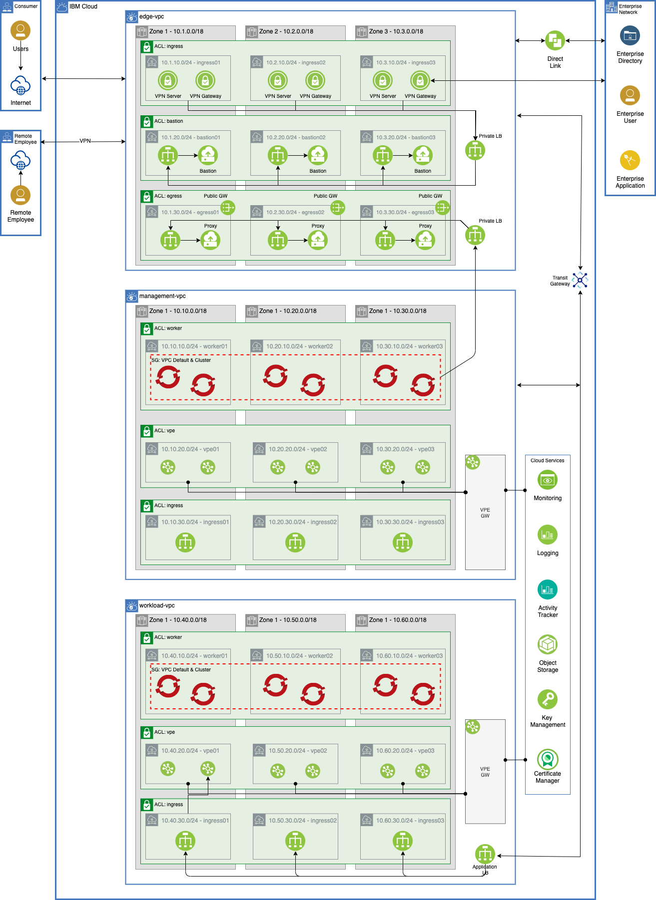

# IBM Cloud - Reference Architectures

> These automation reference automation packages have been crafted from a collection of [Terraform modules](https://github.com/cloud-native-toolkit/garage-terraform-modules/blob/main/MODULES.md) created by GSI Labs team part of the Hybrid Cloud Ecosystem organization. Please contact `Matthew Perrins` **mjperrin@us.ibm.com** or `Sean Sundberg` **seansund@us.ibm.com** for more details. 

This automation package was generated by the open-source [`isacable` tool](https://github.com/cloud-native-toolkit/iascable). This tool enables a defined Bill of Material yaml file to describe you cloud architecure and it will pull the aligned terraform modules into a single package of automation. 

The IBM Cloud defines a set of reference architectures and best practices for establishing a security cloud environment that will enable the deployment and management of workloads.

This repository defines a set of Terraform automation that embodies these best practices for provisioning cloud resources in an IBM Cloud Enterprise Sub account. This guide will help describe the SRE steps required to provision an IBM Cloud environment that will scan cleanly to the Security and Compliance Centers NIST based profiles.

This guide is optimized for Proof of Technology environments that will enable Global Partners and ISVs to configure a fully working end to end cloud-native environment. This will include Management with Bastion and Client to Site VPN. It will include Workload with OpenShift and support the Red Hat Software Delivery Lifecycle with the [Cloud-Native Toolkit](https://cloudnativetoolkit.dev/).

Automation is provided in following Terraform packages that will need to be run in order.

## Reference Architecture

The following is provisioned.



> Limitations, SCC scan has identified a number of gaps that are being work and will be closed soon.

## Automation Stages

Clone this repository to pull down the **Bill of Materials** for the automation to provision this topology on IBM Cloud. This repo contains the following defined *BOMS*. They logically build up to deliver IBM Cloud best practices.

- [100 - Common Services](./100-common-services)
- [120 - Management + OpenShift Cluster](./110-mzr-management-openshift)
- [140 - Workload + OpenShift Cluster](./140-mzr-workload)
- [160 - Developer Tools into Management Cluster](./160-openshift-dev-tools)

We also include packages for non-OpenShift configurations
- [110 - Management VSI](./110-mzr-management)
- [130 - Workload VSI](./130-mzr-workload)

## Prerequisites

1. Have access to an IBM Cloud Account, Enterprise account is best for workload isolation but if you only have a Pay Go account this set of terraform can be run in that level of account.

2. Download OpenVPN Client from https://openvpn.net/vpn-server-resources/connecting-to-access-server-with-macos/#installing-a-client-application for your client device, this has been tested on MacOS

3. At this time the most reliable way of running this automation is with Terraform in your local machine either through a bootstrapped docker image or with native tools installed. 

> The schematics service is producing intermittent issues.

## Setup

### Hyper Protect Crypto

The first step is provision a Hyper Protect Crypto Services instance into the nominated account and initialise the key ceronmony. You can do this with the following automation. We recommend to follow the product docs to perform the quick initialization.  

[Hyper Protect Cyrpto Service Documentation](https://cloud.ibm.com/docs/hs-crypto?topic=hs-crypto-get-started)

For proof of technology environments we recommend using the `auto-init` feature. [Auto Init Documentation](https://cloud.ibm.com/docs/hs-crypto?topic=hs-crypto-initialize-hsm-recovery-crypto-unit)  

#### <a name="generate-hpcs-rootkey"></a> Generate HPCS root key

Once the HPCS instance has been initialized create a Root Key.

1. Open the **Resources** view in IBM Cloud console - https://cloud.ibm.com/resources
2. Expand the **Services** twisty and click on the Hyper Protect Crypto Service (HPCS) instance
3. In HPCS instance page, go to **Key management service keys** in the left menu
3. Click on **Add key** to create a new root key
4. In **Add key** page, provide the details
    - **Key type** : `Root key`
    - **Key name** : Enter a descriptive name for your root key
    - **Key ring ID**: choose `default`
    - **Expiration date**: Chose a date and time
5. Click **Create**
6. Copy the value from **ID field** and save it somewhere. This value will be needed later.

### Security and Compliance

#### <a name="register-scc-apikey"></a> Register an API key with SCC

Set API Key for Security and compliance

1. Open the IBM Cloud console to the **Security and Compliance** tool - https://cloud.ibm.com/security-compliance/overview
2. Under **Manage Posture**, click **Configure** > **Settings**.
3. Open the **Credentials** tab and click **Create** to create a new credential. Provide the following values:
   - **Name**: Provide a descriptive name for the credential
   - **Purpose**: `Discovery/Collection`
4. Click **Next** to advance to the next page. Provide the following values:
   - **Credential type**: `IBM Cloud`
   - **IBM API key**: Enter your IBM Cloud API key
5. Press **Create** to register the API key.

### Terraform IasC Automation

1. Clone this repository to your local SRE laptop and open a terminal to the cloned directory.
2. Run the `create-ssh-keys.sh` script to generate the SSH keys needed for the various VSI instances.
3. Copy `terraform.tfvars.template` to `terraform.tfvars`. This is the file you will use to provide input to the terraform scripts.
4. Create two SCC collectors with private endpoints following the [Generate SCC credentials](#generate-ssc) instructions below; one for Management BOM and one for Workload BOM. Set the values for `mgmt_scc_registration_key` and `workload_scc_registration_key` in **terraform.tfvars**.
5. Provide the root key created in the previous [Generate HPCS root key](#generate-hpcs-rootkey) section as the value for the `kms_key_id` variable in **terraform.tfvars**.
6. Update **terraform.tfvars** with the appropriate values for your deployment. Note: The values are currently set up to place everything in the same resource group. To use different resource groups, provide different values for each of the `*_resource_group_name` variables and comment out the `*_resource_group_provision="false"` values
7. Run `setup-workspace.sh` to create a `workspace` directory that contains the terraform scripts from the different reference architectures and the **terraform.tfvars** and ssh keys generated in the previous steps. (**Note**: The content in the `workspace` directory has been added using symbolic links so changes to the original files will be immediately reflected in each of the subdirectories.)

## Terraform Apply

1. Copy `credentials.template` to `credentials.properties`.
2. Provide your IBM Cloud API key as the value for the `ibmcloud.api.key` variable in `credentials.properties` (**Note:** `*.properties` has been added to `.gitignore` to ensure that the file containing the apikey cannot be checked into Git.)
3. From the root of the cloned repository directory, run `./launch.sh`. This will start a docker container that contains the required libraries to run the terraform scripts. 
4. The container should have opened in the `/terraform/workspace` as the working directory which should be mounted from repository directory on the host.
5. Change directory to the terraform directory that will be applied (e.g. `100-common-services`)
6. Initialize the environment with `terraform init`
7. Apply the terraform with `terraform apply -auto-approve`. If all is configured properly you should not be prompted again and the terraform should run to completion.

## Configure VPN

After running the `120 Management + OpenShift` architecture and before running `160 OpenShift Developer Tools`, the VPN server needs to be set up.

1. Open the IBM Console and go to the **VPC Virtual Server Images** page - https://cloud.ibm.com/vpc-ext/compute/vs
2. Find the VPN VSI instance in the list. (It will have a name like `{mgmt_name_prefix}-vpc-openvpn-00`.) Copy the value for the Floating IP.
4. Open a terminal to cloned repository directory (or wherever the SSH keys are located).
5. SSH into the OpenVPN server - `ssh -i ssh-mgmt-openvpn root@${floating_ip}`
6. Generate a new VPN configuration by running `openvpn-config.sh`. Follow the prompts to add a user. When the command has completed it will generate a file in `/root` on the remote host named after the userid you provided. The file name is printed at the end of the command output.
7. Exit the SSH session.
8. Use secure copy to bring the ovpn file down to your machine by running the following command - `scp -i mgmt-openvpn root@${floating_ip}:/root/${user}.ovpn .`
9. Import the ovpn file into your OpenVPN client and start the VPN connection. You  should now have connectivity into the private VPC network and access to the OpenShift Management Console.

## Reference

### <a name="generate-ssh-keys"></a> Generate SSH Keys

You need to create a set of unique keys that will be configured for the various components that are provisioned by the Terraform automation.

1. The command to generate the ssh keys is `ssh-keygen -t rsa -b 3072 -N "" -f {name}`

2. You will want to run the command 6 times to generate the keys. If you are keeping with the names in the **terraform.tfvars** file then run the following:

    ```shell
    ssh-keygen -t rsa -b 3072 -N "" -f ssh-mgmt-openvpn
    ssh-keygen -t rsa -b 3072 -N "" -f ssh-mgmt-bastion
    ssh-keygen -t rsa -b 3072 -N "" -f ssh-mgmt-scc
    ssh-keygen -t rsa -b 3072 -N "" -f ssh-workload-openvpn
    ssh-keygen -t rsa -b 3072 -N "" -f ssh-workload-bastion
    ssh-keygen -t rsa -b 3072 -N "" -f ssh-workload-scc
    ```

### <a name="generate-ssc"></a> Generate SCC credentials

An SCC registration key is required to register an SCC collector with the tool. For each collector instance a new registration key is required.

1. Open the IBM Cloud console to the **Security and Compliance** tool - https://cloud.ibm.com/security-compliance/overview.
2. Under **Manage Posture**, click **Configure** > **Settings**.
3. On the **Collectors** tab, click **Create**. Provide the following values:
    - **Name**: Enter a descriptive name for the collector
    - **Collector Endpoint**: `Private endpoint`
4. Click **Create** to define the collector instance.
5. From the **Collectors** tab, click on the collector you just created to expand the collector information.
6. Copy the value for the **Registration key**. This will be needed in terraform input to initialize the SCC collector.

## Troubleshooting


